# Laporan Praktikum Basis Data - Pertemuan 01
**Nama** : Mufid Falih Huda

**NPM** : 25430106

**Kelas** : D

**Tanggal** : 06 Oktober 2026

**Dosen Pengampu** : Dedi Irawan, S.Kom., M.Kom.

## 1. Tujuan Praktikum
Di modul 1 ini, ada beberapa tujuan yang harus dicapai, yaitu dapat menjalankan dan menghentikan MariaDB dari XAMPP, mengehubungkan ke server MariaDB melalui perintah (CLI) dan melalui phpMyAdmin, membuat password untuk akun root dan membuat akun kerja (user) dan memberi hak akses ke databse, dan terakhir menghubungakan hasil kerja ke repository yang terhubung ke Github.

## 2. Ringkasan Dasar Teori
MariaDB merupakan suatu sistem manajeman basis data yang mengelolah dan menyimpan suatu data. MariaDB bekerja dengan pola klien-server. Disini server (MariaDB) dijalankan melalui XAMPP dan klien dapat mengakses server MariaDB ini dengan menggunakan CLI atau pun phpmyadmin. CLI berbasis teks sedangkan phpmyadmin menyediakan antarmuak berbasis web.

## 3. Hasil Langkah Percobaan
### 3.1 Login akun root
Login akun root dengan mysql -u root, dan jalankan SELECT VERSION(), CURRENT_USER(); untuk melihat versi.
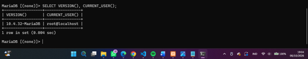

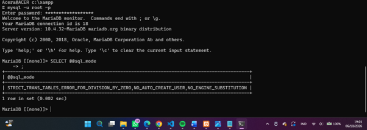
Hasil dari SELECT @@sql_mode;

### 3.2 Hasil membuat Password di akun root.
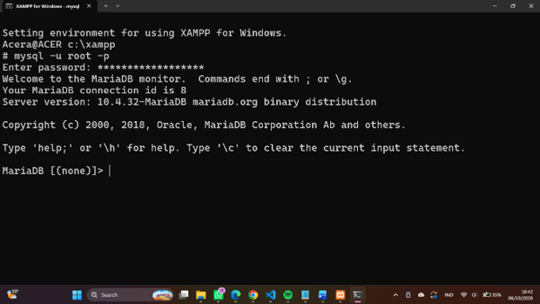
*Gambar: Hasil tes login akun root menggunakan pasword*

### 3.3 Membuat basisdata dan akun.
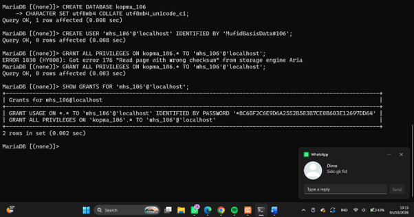
*Membuat databse (kopma_106) dan akun (mhs_106)*
Disini akun mhs_106 diberi hak akses ke databse kopma_106..

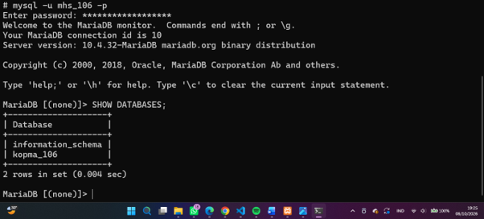
*HASIL SHOW DATABASES PADA AKUN mhs_106*
### 3.4 Login ke phpmyadmin.
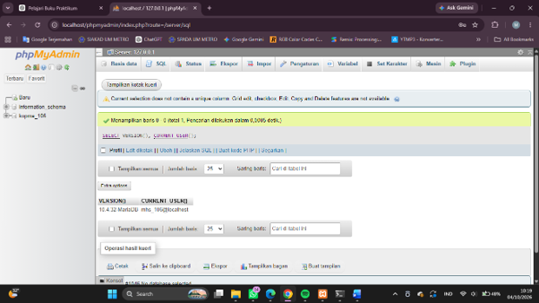

### 3.5 Menghubungkan folder kerja ke repository di Github dengan git.
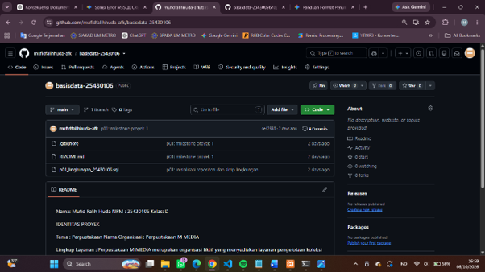
*Folder kerja yang berhasil masuk ke github*
INI ADALAH PUSH PERTAMA KE GITHUB

## 4. Jawaban Titik Analisis
### **Titik Analisis 1**

Label tombol bertuliskan “MySQL”, tetapi yang berjalan adalah MariaDB. Apa konsekuensinya ketika Anda mencari solusi galat di internet? Kapan dokumentasi MySQL masih relevan, dan kapan Anda harus merujuk ke dokumentasi MariaDB.

**JAWABAN** : 
Label tombol pada XAMPP bertuliskan “MySQL
tetapi server yang sebenarnya berjalan adalah MariaDB 10.4.32.

Dokumentasi MySQL masih relevan untuk perintah atau konsep SQL yang kompatibel dengan MariaDB. Namun, jika mengalami galat yang berkaitan dengan perilaku, konfigurasi, versi, atau fitur khusus MariaDB, maka sebaiknya merujuk ke dokumentasi MariaDB. Hal ini penting agar solusi yang digunakan sesuai dengan server yang sebenarnya berjalan pada XAMPP.

Jadi, saat mencari solusi galat, kita perlu memastikan terlebih dahulu bahwa server yang digunakan adalah MariaDB, bukan hanya melihat label “MySQL” pada XAMPP.

### **Titik Analisis 2**

Keluar lagi, lalu coba masuk dengan mysql -u root tanpa -p. Catat pesan galat yang muncul. Bagian mana dari pesan itu yang memberi tahu bahwa klien tidak mengirim password? Bandingkan jawaban Anda dengan Gambar 1.10 di bagian Troubleshooting.

**JAWABAN** :
Pesan Galat : ERROR 1045 (28000): Access denied for user 'root'@'localhost' (using password: NO)

Bagaian yang memberitahu klien tidak memberi password adalah "USING PASSWORD : NO". Tanpa -p jika akun root sudah diberi password, maka tidak bisa masuk. using password : NO artinya klien sama sekali tidak memasukan password. ada lagi "using password : YES" artinya password yang diinput salah.

### **Titik Analisis 3**

Mengapa information_schema tetap terlihat oleh mhs_123, sedangkan mysql ditolak dengan ERROR 1044? Apa bedanya kode galat 1044 dengan 1045?

**JAWABAN** :
information_schema dapat muncul karna itu database sistem mariaDB yang dapat muncul pada daftar database. mysql ditolah karna akun mhs_123 tidak memunyai hak untuk mengakses data tersebut.

Perbedaan kode galat 1044 dengan 1045, adalah, 1044 menandakan klien berhasil login, tapi tidak punya izin untuk mengakses databse tertentu, dan 1045 berarti klien gagal melakukan login.

### **Titik Analisis 4**

Mode cookie meminta pengguna mengetik password setiap kali masuk. Mengapa mode ini lebih aman daripada mode config yang menyimpan password di dalam berkas konfigurasi?

**JAWABAN** :
Mode cookie tidak menyimpan password di file konfig, sehingga harus memasukan password, sedangkan mode config password disimpan dalam berkas konfigurasi. Jika file berkas bocor, password dapat diketahui orang lain.

## 5. Hasil Latihan dan Modifikasi
### 5.1 Membuat akun tamu_106
Latihan ini membuat akun user tamu_106 dan mempunyai hak akses SELECT ke databse kopma_106.
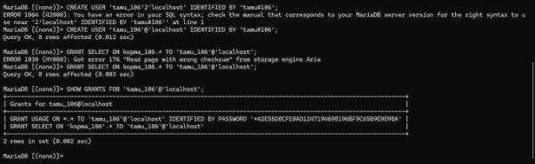

Hasil tes ketika akun tamu mencoba CREATE TABLE
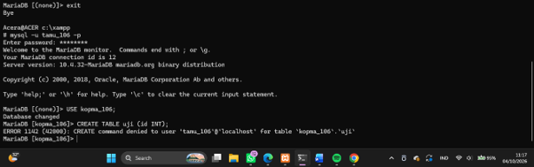
*ERROR 1142 (42000) : CREATE command denied to user ‘tamu_160’@’localhost’ for table ‘kopma_106’. ‘uji’*

ERROR ini terjadi karena akun tamu_106 tidak mempunyai hak akss membuat tabel kopma_106.

### 5.2 Ubah skrip  p01_lingkungan_25430106.sql
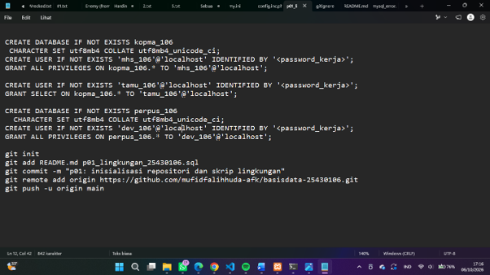

## 6. Tugas Mandiri: Milestone Proyek 01
Membangun proyek pribadi. Tema ditentukan NPM. Saya mendapat tema perpusatakaan.

### 6.1 Membuat database dan akun kerja berdasarkan tema.
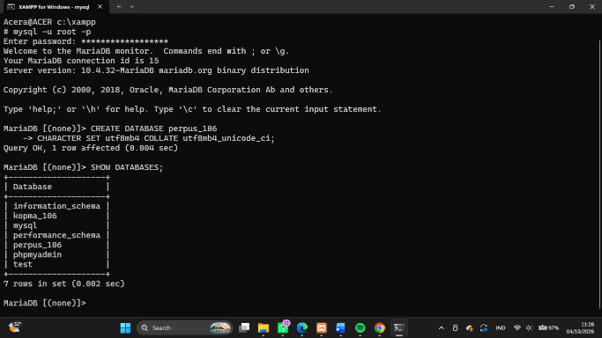
*Membuat database perpus_106 menggunakan CREATE DATABASE*

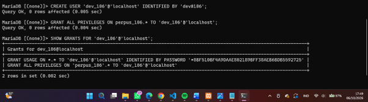
*Membuat akun kerja dev_106 dan memberi hak akses ke perpus_106*
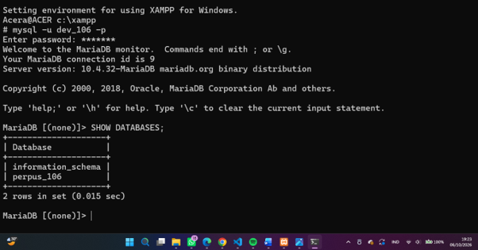
*SHOW DATABASE PADA AKUN dev_106*

### 6.2 Menambahkan Identitas Proyek yang dibuat.
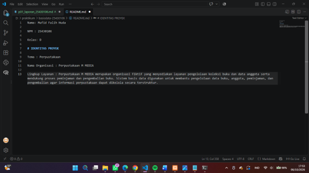
*Menambahkan identitas proyek berupa tema, nama organisasi dan lingkup layanan*

### 6.2 Tamabahkan berkas .gitignore dan push ke github bersama README.md yg diperbarui.
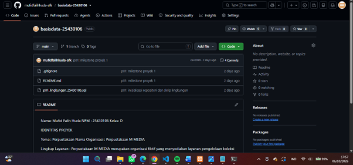
Push ke github berkas yang baru diperbarui dan ditambahkan dengan git add . lalu git push, dengan pesan commit p01: milestone proyek 1.

## 7. Pembahasan dan Kendala
### 7.1 Konfigurasi pada SELECT @@sql_mode
Saat menjalankan SELECT @@sql_mode muncul hasil yang tidak diharapkan modul. Muncul NO_ZERO_IN_DATE,NO_ZERO_DATE,NO_ENGINE_SUBSTITUTION.

Lalu solusi ada pada Troubleshooting masalah 5, disitu dijelaskan, harus menambahkan skrip pada  C:\xampp\mysql\bin\my.ini dibagian [mysqld].
### 7.2 Kesalahan dalam mengetik username.
Sering kali terjadi kesalahan dalam mengetik username ketika ingin login atau pun lainnya. Dengan contoh ingin memberi hak akses kopma, dan terjadi kesalahan input dari kopma menjadi kompa.

### 7.3 Kesulitan dalam memahami konsep git dan github.
Pada awal penggunaan Git dan GitHub, terdapat kebingungan mengenai fungsi git add, git commit, dan git push, termasuk apakah setiap perubahan pada modul harus selalu di-push.

Solusinya adalah memahami alur dasar Git:

git add memasukkan perubahan ke staging area, git commit mencatat perubahan sebagai commit, sedangkan git push mengirim commit tersebut ke repository GitHub.

### Pembahasan
Dari berbagai kendala tersebut, dapat dipahami bahwa penggunaan MariaDB tidak hanya membutuhkan kemampuan menulis perintah SQL, tetapi juga pemahaman mengenai akun, hak akses, konfigurasi server, serta ketelitian dalam penamaan database dan user. Penggunaan Git juga membutuhkan pemahaman mengenai hubungan antara perubahan file lokal, commit, dan repository GitHub.

## 8. Kesimpulan
Praktikum di modul 1 ini memberi pemahaman mengenai server mariaDB di aplikasi XAMPP, pembuatan akun dan database pada server mariaDB, pemberian hak akses pada akun yang dibuat, serta penggunaan git dan github untuk mengelola hasil kerja setuiap pertemuan.

## 9. Pernyataan Penggunaan AI
Saya menggunakan CHATgpt untuk membantu memahami dan mempelajari materi dan juga bagaimana langkah yang harus dilakukan untuk menyelesaikan modul 1. 
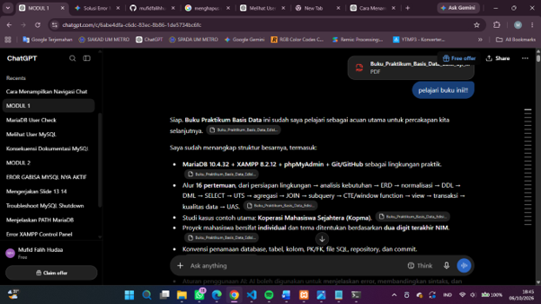

## 10. Bukti Git
Repository : https://github.com/mufidfalihhuda-afk/basisdata-25430106

Commit: p01: milestone proyek 1

Hash commit: ce42998

## Checklist

## Checklist Umum

| Butir                    | Yang harus ada                                                                                       | Status |
| ------------------------ | ---------------------------------------------------------------------------------------------------- | :----: |
| Identitas                | Nama, NIM, kelas, pertemuan ke-N, tanggal pelaksanaan, nama asisten/dosen                            |    ☑   |
| Tujuan                   | Tujuan praktikum ditulis ulang dengan bahasa sendiri (maksimal 5 baris)                              |    ☑   |
| Ringkasan teori          | Pemahaman sendiri atas Dasar Teori, maksimal setengah halaman, tanpa menyalin buku                   |    ☑   |
| Langkah percobaan (D)    | Tangkapan layar hasil langkah kunci sesuai checklist khusus, masing-masing diberi keterangan singkat |    ☑   |
| Titik Analisis           | Semua Titik Analisis dijawab lengkap dengan alasan, bukan sekadar ya/tidak                           |    ☑   |
| Latihan (E)              | Skrip/dokumen hasil latihan beserta bukti berjalan                                                   |    ☑   |
| Tugas Mandiri (F)        | Milestone proyek pertemuan ini: berkas, bukti, dan penjelasan keputusan desain                       |    ☑   |
| Pembahasan dan kendala   | Galat yang ditemui, cara membacanya, dan cara mengatasinya                                           |    ☑   |
| Kesimpulan               | Dua sampai empat kalimat dengan bahasa sendiri                                                       |    ☑   |
| Pernyataan Penggunaan AI | Alat yang dipakai, untuk apa, bagian mana                                                            |    ☑   |
| Bukti Git                | Tautan repositori dan kode commit (hash) pertemuan ini dengan pesan `pNN: ...`                       |    ☑   |
| Keaslian                 | Setiap tangkapan layar memperlihatkan akun ber-NIM dan jam sistem; nama objek memuat NIM/inisial     |    ☑   |

## Checklist Khusus Pertemuan 1

| Jenis                 | Yang harus ada                                                                                         | Status |
| --------------------- | ------------------------------------------------------------------------------------------------------ | :----: |
| Berkas wajib          | `p01_lingkungan_<NIM>.sql` (dapat dijalankan ulang), `README.md` berisi Identitas Proyek, `.gitignore` |    ☑   |
| Bukti tangkapan layar | `SELECT VERSION(), CURRENT_USER();`                                                                    |    ☑   |
| Bukti tangkapan layar | `SELECT @@sql_mode;`                                                                                   |    ☑   |
| Bukti tangkapan layar | `SHOW DATABASES` sebagai `mhs_<3d>`                                                                    |    ☑   |
| Bukti tangkapan layar | `SHOW DATABASES` sebagai `dev_<3d>`                                                                    |    ☑   |
| Bukti tangkapan layar | Galat 1044 dan 1142                                                                                    |    ☑   |
| Bukti tangkapan layar | Halaman masuk phpMyAdmin mode cookie                                                                   |    ☑   |
| Bukti tangkapan layar | `git push` pertama                                                                                     |    ☑   |
| Analisis wajib        | Titik Analisis 1–4                                                                                     |    ☑   |
| Analisis wajib        | Perbedaan kode galat 1044, 1045, dan 1142                                                              |    ☑   |

