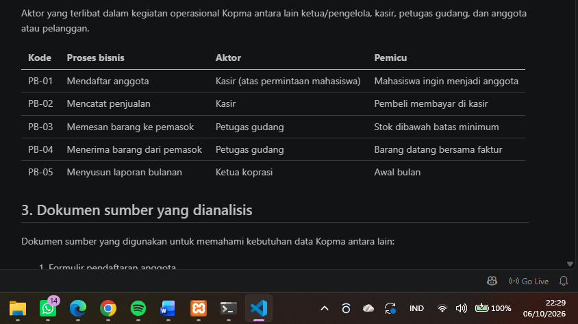
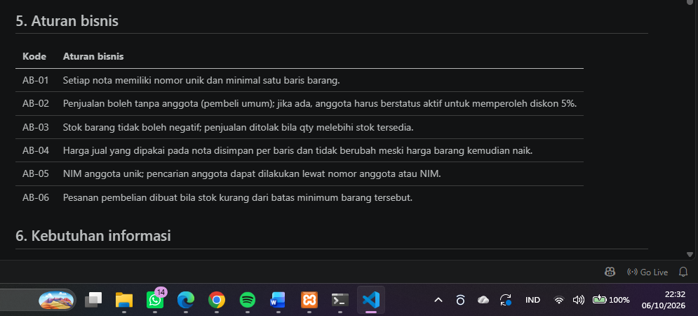
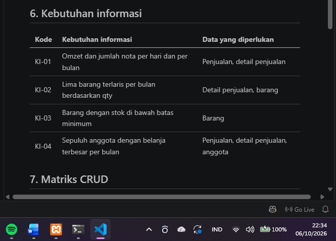
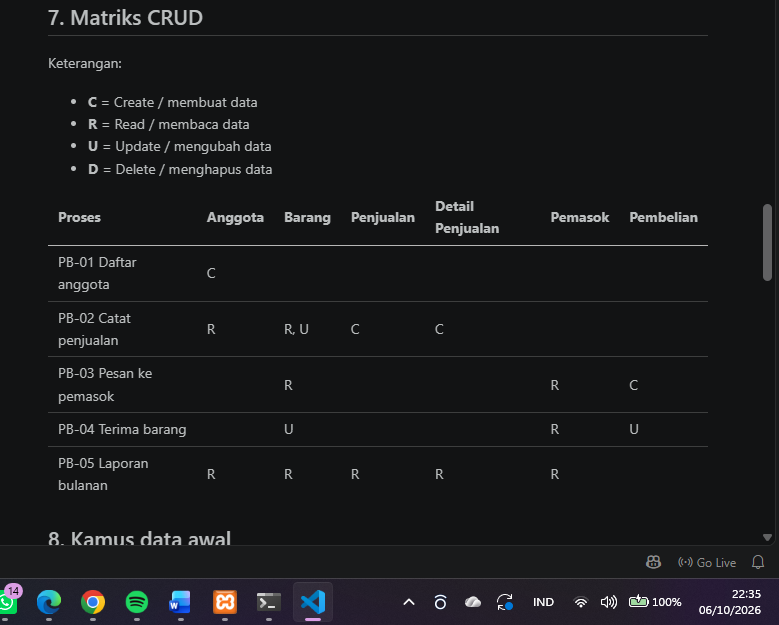
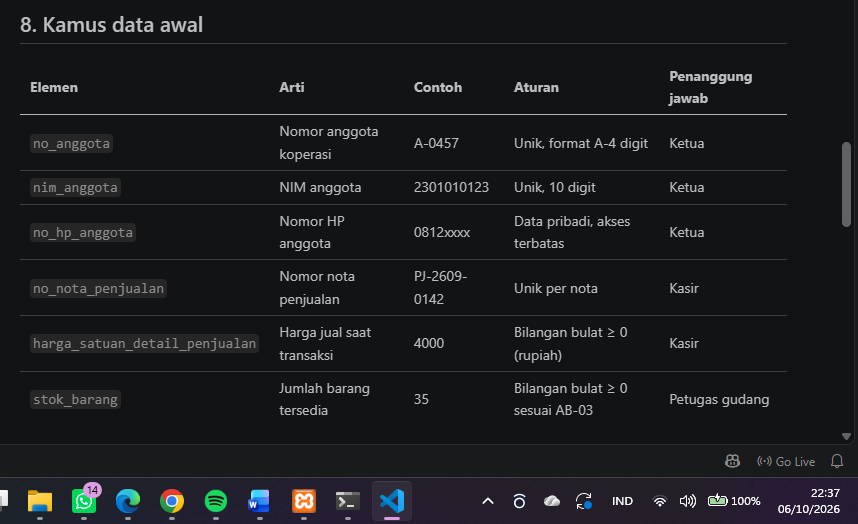
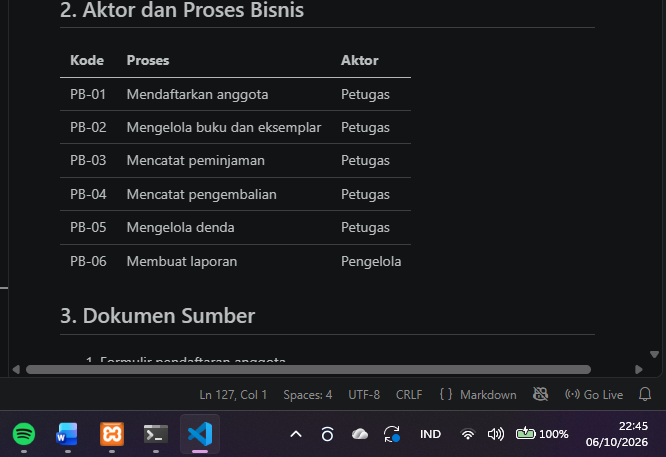
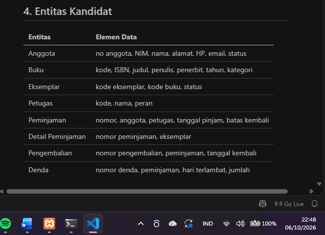
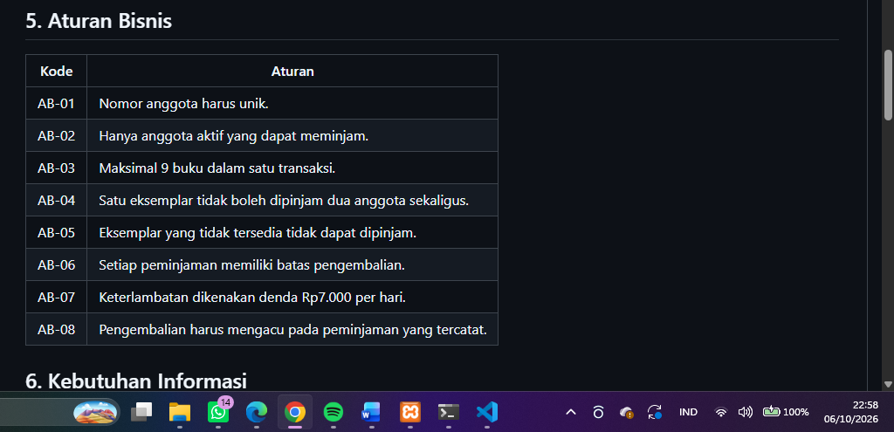
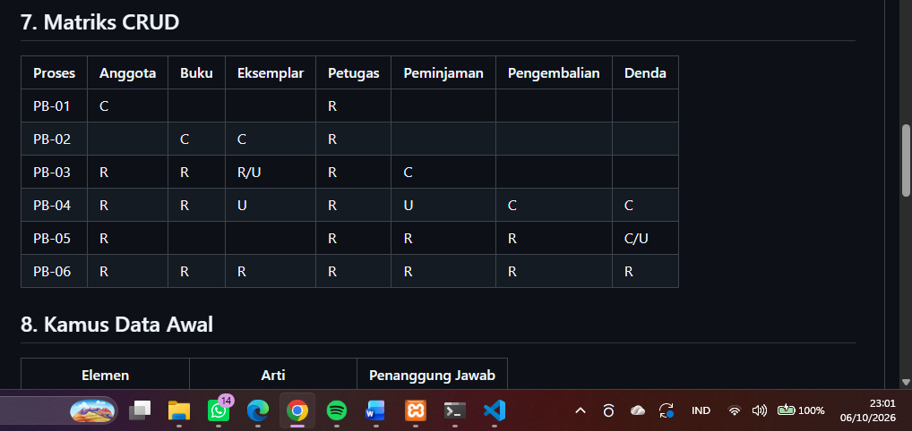
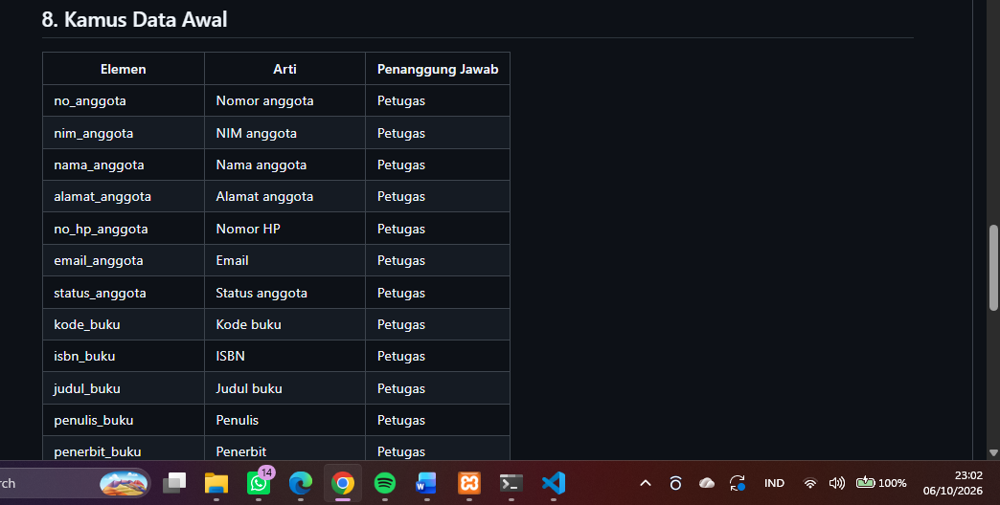

# Laporan Praktikum Basis Data - Pertemuan 02
**Nama** : Mufid Falih Huda

**NPM** : 25430106

**Kelas** : D

**Tanggal** : 06 Oktober 2026

**Dosen Pengampu** : Dedi Irawan, S.Kom., M.Kom.

## 1. Tujuan Praktikum

Praktikum Pertemuan 2 bertujuan untuk melakukan analisis kebutuhan data berdasarkan proses bisnis organisasi. Analisis dilakukan dengan mengidentifikasi proses bisnis, dokumen sumber, entitas, aturan bisnis, kebutuhan informasi, matriks CRUD, kamus data, kebutuhan non-fungsional, dan masalah kualitas data.

Selain itu, praktikum bertujuan menerapkan analisis tersebut pada proyek basis data pribadi sebagai dasar untuk tahap perancangan basis data berikutnya.

## 2. Ringkasan Dasar Teori
Analisis kebutuhan data merupakan tahap untuk menentukan data apa saja yang perlu dikelola oleh suatu organisasi berdasarkan proses bisnisnya.
Matriks CRUD digunakan untuk memastikan setiap entitas memiliki proses yang membuat, membaca, mengubah, atau menghapus data sesuai kebutuhan proses bisnis.
Kamus data digunakan untuk menjelaskan arti setiap elemen data, contoh nilai, aturan, dan pihak yang bertanggung jawab terhadap data.

## 3. Hasil Langkah Percobaan
# 3.1 Identifikasi Proses Bisnis Kopma
Pada studi kasus Kopma, proses bisnis yang diidentifikasi meliputi pendaftaran anggota, pencatatan penjualan, pemesanan barang kepada pemasok, penerimaan barang, dan penyusunan laporan.

# 3.2 Identifikasi Aturan Bisnis
Aturan bisnis digunakan untuk menentukan batasan yang harus dipenuhi dalam proses pengelolaan data Kopma.

Contohnya adalah nomor nota harus unik, stok tidak boleh negatif, anggota harus aktif untuk mendapatkan diskon, dan harga pada transaksi harus tetap tersimpan sebagai harga historis.

# 3.3 Identifikasi Kebutuhan Informasi
Kebutuhan informasi diperoleh dari informasi yang diperlukan pengelola untuk menjalankan dan mengevaluasi kegiatan Kopma.

Beberapa informasi yang dibutuhkan antara lain omzet, barang terlaris, stok di bawah batas minimum, dan anggota dengan belanja terbesar.

# 3.4 Matriks CRUD

Matriks CRUD digunakan untuk mengetahui hubungan antara proses bisnis dengan entitas data melalui operasi Create, Read, Update, dan Delete.

Matriks CRUD juga membantu menemukan entitas yang belum memiliki proses untuk membuat data.

# 3.5 Kamus Data
Kamus data berisi penjelasan mengenai elemen data yang digunakan organisasi. Informasi yang dicatat meliputi nama elemen, arti, contoh, aturan, dan penanggung jawab.

## 4. Jawaban Titik Analisis

# 4.1 Titik Analisis 1 — Harga Historis

Harga saat transaksi perlu disimpan pada detail penjualan karena harga barang dapat berubah. Jika sistem hanya mengambil harga terbaru dari tabel barang, transaksi lama dapat menunjukkan harga yang berbeda dari harga sebenarnya ketika transaksi terjadi.

Dengan menyimpan harga saat transaksi, riwayat transaksi tetap menunjukkan harga yang berlaku ketika transaksi dilakukan.

# 4.2 Titik Analisis 2 — Nilai Turunan

Subtotal dan total merupakan nilai yang dapat dihitung dari data transaksi, seperti jumlah barang, harga, dan diskon.

Nilai tersebut dapat dihitung kembali sehingga perlu dipertimbangkan apakah harus disimpan atau cukup dihitung ketika dibutuhkan. Penyimpanan nilai turunan dapat menimbulkan risiko ketidaksesuaian apabila data sumber berubah.

# 4.3 Titik Analisis 3 — Entitas Tanpa Create

Pada matriks CRUD Kopma ditemukan entitas yang belum mempunyai operasi Create. Hal tersebut menunjukkan bahwa proses bisnis belum menjelaskan bagaimana data entitas tersebut pertama kali dibuat.

Untuk memperbaikinya diperlukan proses bisnis pengelolaan data pemasok sehingga entitas Pemasok mempunyai operasi Create yang jelas.

## 5. Hasil Latihan dan Modifikasi
# 5.1 Penambahan Poin Loyalitas

Kopma dimodifikasi dengan penambahan sistem poin loyalitas. Aturannya:

setiap kelipatan Rp10.000 belanja anggota menghasilkan 1 poin
setiap 50 poin dapat ditukar dengan potongan Rp5.000.

Perubahan yang dilakukan:

1. Menambahkan elemen poin_loyalitas.
2. Menambahkan aturan bisnis AB-07 sampai AB-09.
3. Menambahkan kebutuhan informasi mengenai saldo dan jumlah poin anggota.
4. Memperbarui matriks CRUD.
5. Menambahkan poin_loyalitas ke kamus data.

# 5.2 Perbaikan Kebutuhan Kabur

Tiga kebutuhan yang awalnya masih kabur diperbaiki menjadi kebutuhan yang dapat diuji.

1. Keamanan data

Sebelum: Data anggota harus aman.

Sesudah: Nomor HP anggota hanya dapat dilihat oleh ketua koperasi dan petugas yang memiliki hak akses pengelolaan anggota.

2. Kecepatan sistem

Sebelum: Sistem harus cepat mencari barang.

Sesudah: Sistem harus dapat menampilkan data barang berdasarkan kode barang atau nama barang dalam waktu maksimal 2 detik untuk data sampai dengan 10.000 barang.

3. Keakuratan laporan

Sebelum: Laporan stok harus akurat.

Sesudah: Nilai stok pada laporan harus sama dengan jumlah stok yang tercatat pada data barang setelah seluruh transaksi penerimaan dan penjualan yang telah berhasil diproses diperhitungkan.

## Tugas Mandiri — Milestone Proyek 2
# 6.1 Identitas Proyek

Tema: Perpustakaan

Nama Organisasi: Perpustakaan M MEDIA

Lingkup Layanan: Perpustakaan M MEDIA merupakan organisasi fiktif yang menyediakan layanan pengelolaan koleksi buku dan data anggota serta mendukung proses peminjaman dan pengembalian buku. Sistem basis data digunakan untuk membantu pengelolaan data buku, anggota, peminjaman, dan pengembalian agar informasi perpustakaan dapat dikelola secara terstruktur.

# 6.2 Proses Bisnis
Proses bisnis yang diidentifikasi:

# 6.3 Entitas Kandidat
Entitas yang digunakan:

Satu judul buku dapat mempunyai beberapa eksemplar sehingga data Buku dan Eksemplar dipisahkan.

# 6.4 Aturan Bisnis

Aturan bisnis yang digunakan dalam proyek Perpustakaan M MEDIA meliputi:

# 6.5 Kebutuhan Informasi

Kebutuhan informasi proyek Perpustakaan M MEDIA meliputi:

1. Daftar anggota aktif.
2. Ketersediaan buku.
3. Daftar buku yang sedang dipinjam.
4. Daftar anggota yang terlambat.
5. Jumlah peminjaman dan pengembalian dalam suatu periode.

# 6.6 Matriks CRUD

Matriks CRUD digunakan untuk memastikan setiap proses bisnis memiliki hubungan dengan data yang dikelola.

Entitas utama yang terlibat adalah Anggota, Buku, Eksemplar, Petugas, Peminjaman, Pengembalian, dan Denda.

# Kamus Data

Kamus data proyek memuat elemen-elemen data yang diperlukan untuk mengelola informasi perpustakaan.

Beberapa elemen data yang digunakan adalah:

# 6.8 Parameter Personal

Dua digit terakhir NIM adalah 06.

Perhitungan parameter personal:

P = (06 mod 9) + 1
P = 7

Berdasarkan nilai tersebut:

maksimal buku dalam satu transaksi = P + 2 = 9 buku;
denda keterlambatan = P × Rp1.000 = Rp7.000 per hari;
perkiraan transaksi harian = 40 + (5 × P) = 75 transaksi per hari.
# 6.9 Kebutuhan Non-Fungsional

Kebutuhan non-fungsional proyek Perpustakaan M MEDIA meliputi:

Data pribadi anggota harus dibatasi berdasarkan hak akses.
Data anggota harus dilindungi dari perubahan yang tidak berwenang.
Sistem harus mampu menangani sekitar 75 transaksi per hari.
Riwayat peminjaman dan pengembalian harus dipertahankan.
Data transaksi harus konsisten dengan status eksemplar.

Data pribadi yang perlu dilindungi meliputi NIM, alamat, nomor HP, dan email.

# 6.10 Isu Kualitas Data

Isu kualitas data yang perlu diperhatikan adalah:

Nomor anggota atau NIM tidak boleh ganda.
Data anggota harus lengkap.
Status eksemplar harus sesuai kondisi sebenarnya.
Buku yang sedang dipinjam tidak boleh tercatat sebagai tersedia.
Perhitungan denda harus sesuai dengan jumlah hari keterlambatan.
Data Buku dan Eksemplar harus konsisten.

## 7. Pembahasan dan Kendala

Analisis kebutuhan data membantu menentukan data yang diperlukan sebelum masuk ke tahap perancangan basis data.

Pada proyek Perpustakaan M MEDIA, salah satu hal penting adalah memisahkan entitas Buku dan Eksemplar. Satu judul buku dapat mempunyai beberapa eksemplar sehingga informasi keduanya perlu dikelola secara terpisah.

Kendala yang ditemukan adalah menentukan data yang perlu disimpan, membedakan data utama dan data turunan, serta memastikan hubungan antara proses bisnis dan entitas melalui matriks CRUD.

## 8. Kesimpulan

Praktikum Pertemuan 2 menghasilkan analisis kebutuhan data untuk studi kasus Kopma dan proyek Perpustakaan M MEDIA.

Analisis yang dilakukan meliputi proses bisnis, dokumen sumber, entitas, aturan bisnis, kebutuhan informasi, matriks CRUD, kamus data, kebutuhan non-fungsional, dan isu kualitas data.

Pada proyek Perpustakaan M MEDIA telah ditentukan 6 proses bisnis, 8 entitas, 8 aturan bisnis, 5 kebutuhan informasi, dan minimal 20 elemen kamus data.

Berdasarkan NIM 25430106 diperoleh nilai P = 7. Dengan demikian, maksimal peminjaman adalah 9 buku dalam satu transaksi, denda keterlambatan sebesar Rp7.000 per hari, dan perkiraan transaksi sebanyak 75 transaksi per hari.

## 9. Pernyataan Penggunaan AI

Dalam pengerjaan praktikum ini, ChatGPT digunakan sebagai alat bantu untuk memahami materi, menyusun draft kebutuhan data, memeriksa kelengkapan komponen dokumen, dan membantu merapikan format Markdown.

## 10. Bukti GIt
Repository : https://github.com/mufidfalihhuda-afk/basisdata-25430106
HASH COMMIT :

010e35b p02: dokumen kebutuhan data
b8bbca8 p02: dokumen kebutuhan data kopma

## Checklist Laporan Pertemuan 2

| Jenis                   | Yang harus ada                                                                         | Cek |
| ----------------------- | -------------------------------------------------------------------------------------- | :-: |
| ☐ Berkas wajib          | `p02_kebutuhan_data_kopma_25430106.md` dan `p02_kebutuhan_data_25430106.md` (proyek)   |  ☑  |
| ☐ Bukti tangkapan layar | Tabel PB, AB, KI, matriks CRUD, dan kamus data di berkas proyek (tampilan GitHub)      |  ☑  |
| ☐ Analisis wajib        | Titik Analisis 1–3; perhitungan parameter P; perbaikan tiga pernyataan kebutuhan kabur |  ☑  |

## Checklist Umum

| Butir                      | Yang harus ada                                                                                       | Cek |
| -------------------------- | ---------------------------------------------------------------------------------------------------- | :-: |
| ☐ Identitas                | Nama, NIM, kelas, pertemuan ke-2, tanggal pelaksanaan, nama asisten/dosen                            |  ☑  |
| ☐ Tujuan                   | Tujuan praktikum ditulis ulang dengan bahasa sendiri                                                 |  ☑  |
| ☐ Ringkasan teori          | Pemahaman sendiri atas Dasar Teori, tanpa menyalin buku                                              |  ☑  |
| ☐ Langkah percobaan (D)    | Tangkapan layar hasil langkah kunci sesuai checklist khusus, masing-masing diberi keterangan singkat |  ☑  |
| ☐ Titik Analisis           | Semua Titik Analisis dijawab lengkap dengan alasan                                                   |  ☑  |
| ☐ Latihan (E)              | Skrip/dokumen hasil latihan beserta bukti berjalan                                                   |  ☑  |
| ☐ Tugas Mandiri (F)        | Milestone proyek pertemuan ini: berkas, bukti, dan penjelasan keputusan desain                       |  ☑  |
| ☐ Pembahasan dan kendala   | Galat yang ditemui, cara membacanya, dan cara mengatasinya                                           |  ☑  |
| ☐ Kesimpulan               | Dua sampai empat kalimat dengan bahasa sendiri                                                       |  ☑  |
| ☐ Pernyataan Penggunaan AI | Alat yang dipakai, untuk apa, dan bagian mana                                                        |  ☑  |
| ☐ Bukti Git                | Tautan repositori dan kode commit (hash) pertemuan ini dengan pesan `pNN: ...`                       |  ☑  |
| ☐ Keaslian                 | Setiap tangkapan layar memperlihatkan akun ber-NIM dan jam sistem; nama objek memuat NIM/inisial     |  ☑  |
